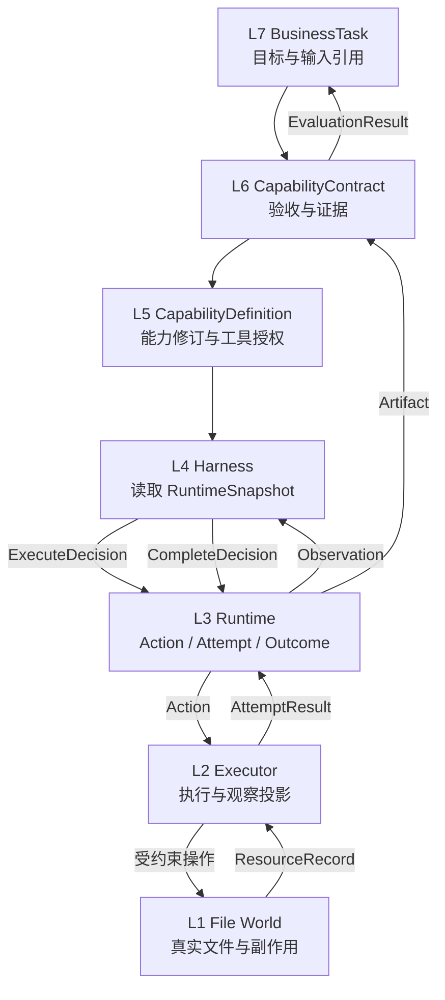

# Agent Platform Python 参考实现

这是一个无第三方运行时依赖的模块化单体，目标是用一条可运行纵切片验证七层架构边界，而不是实现新的通用 Agent 框架。

案例任务：读取工作空间中的架构说明，生成 Markdown 报告并进行确定性验收。案例还会模拟：

1. 第一个动作完成后进程重启，通过执行检查点继续同一个 `Run`；
2. 写文件已经成功，但响应丢失并返回 `timeout`；
3. L3 将动作标记为 `OutcomeUnknown`，向 L1 核对副作用后判定 `Succeeded`，不盲目重试。

## 运行

要求 Python 3.11+。

```bash
cd examples/python-runtime
PYTHONPATH=src python3 -m agent_runtime.demo --case-root /tmp/agent-platform-case
PYTHONPATH=src python3 -m unittest discover -s tests -v
```

输出文件：

```text
/tmp/agent-platform-case/
├── runtime.db                    # L3 领域状态、事件、状态视图、执行检查点
├── case_result.json              # 七层对象与完整执行追踪
└── workspace/
    ├── input/architecture.md     # L1 输入资源
    ├── output/report.md          # L3 Artifact 指向的 L1 正式产物
    └── .idempotency/             # L1 副作用核对记录
```

## 各层数据模型

| 层级 | 本例核心模型 / 组件 | 拥有的数据 | 向下一层传递什么 |
|---|---|---|---|
| L7 业务 / 产品 | `BusinessTask` | `goal`、输入/输出引用、业务状态、验收制品 | 目标与责任，不指定执行机制 |
| L6 能力契约 | `CapabilityContract`、`EvaluationResult` | 输入规格、验收/质量标准、证据要求、评估结论 | 稳定能力规格 |
| L5 能力工程 | `CapabilityDefinition`、`ToolSpec`、`CapabilityRegistry` | 能力修订、技能修订、允许使用的工具和风险 | 被解析后的能力与工具授权 |
| L4 执行策略 | `ReportHarness`、`RuntimeSnapshot`、四类 `Decision` | 当前策略步骤，以及对 L3 事实的选择性上下文 | `Execute / Wait / Complete / Fail` 决策 |
| L3 统一运行时 | `Work`、`Session`、`Run`、`Action`、`ExecutionAttempt`、`AttemptResult`、`ActionOutcome`、`Observation`、`Artifact`、`Event`、`StateView`、`ExecutionCheckpoint` | 权威执行状态、历史事实、恢复位置和因果关联 | 可治理的逻辑动作；不包含具体工具实现 |
| L2 工作环境 | `LocalActionExecutor`、`ObservationProjector`、`ArtifactVerifier` | 具体执行、观察投影、确定性验证、工具授权检查 | 对 L1 的受约束读写；向 L3 返回物理执行结果 |
| L1 基础设施 / 真实世界 | `LocalFileWorld`、`ResourceRecord` | 文件真实状态、内容摘要、幂等副作用记录 | 真实读取结果或副作用证据 |

横切能力在本例中的落点：事件日志提供可观测性，能力允许列表和工作空间根目录提供最小治理边界，幂等键支持可靠性，L6 验证结果提供评估证据。

## 正向数据流与返回数据流



这里有四个不能合并的数据转换：

```text
L4 Decision
→ L3 Action：策略意图变成有身份、可治理的逻辑动作

L3 Action
→ L2 ExecutionAttempt：一个逻辑动作被某个具体执行器真实执行一次

L2 AttemptResult
→ L3 ActionOutcome：物理返回经过结果判定，得到逻辑动作的最终效果

L3 ActionOutcome
→ L2 Observation
→ L4 Context：先投影为适合智能体观察的数据，再由执行框架选择是否进入工作集
```

## 案例中的对象关联

```text
BusinessTask
  └─ contract_id → CapabilityContract
       └─ capability_id → CapabilityDefinition
            └─ Work
                 └─ Session
                      └─ Run
                           ├─ Action(read_text)
                           │    └─ Attempt(1) → Result(succeeded) → Outcome(succeeded)
                           └─ Action(write_text)
                                └─ Attempt(1) → Result(timeout)
                                     └─ Outcome(unknown)
                                          └─ reconcile L1 → Outcome(succeeded)
```

重要状态变化：

| 对象 | 状态变化 |
|---|---|
| `BusinessTask` | `submitted → accepted`，发生在 L6 验收通过后 |
| `Work` | `open → completed`，`RunCompleted` 后仍保持 `open`，直到 L6 验收通过 |
| `Run` | `ready → running → completed`，进程重启不创建新 `Run` |
| 执行框架状态 | `read_source → write_report → complete → terminal`，保存在执行检查点中，L3 不解释其内部含义 |
| `write_text Action` | `requested → running → outcome_unknown → succeeded` |
| `write_text AttemptResult` | 固定为 `timeout`，不会被核对结果反向修改 |
| `write_text ActionOutcome` | `unknown → succeeded`，依据 L1 幂等记录完成结果核对 |

## 代码边界

```text
application.py       L7-L1 组合与业务验收闭环
l5_capability.py     L5 能力发现
l4_harness.py        L4 策略，只产生 Decision
l3_runtime.py        L3 RunEngine + ActionCoordinator
persistence.py       L3 RuntimeStore（SQLite）
l2_environment.py    L2 Executor + Observation + Verification
l1_world.py          L1 本地文件资源适配器
models.py            各层 Schema 与稳定边界类型
```

依赖约束：Harness 不直接调用工具，Executor 不理解任务策略，Runtime 不依赖具体工具实现。替换 `ReportHarness` 或 `LocalActionExecutor` 时，L3 领域模型不变。
